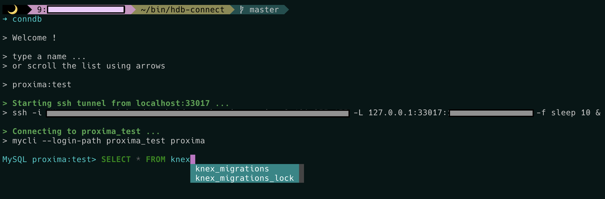

# Description

This program is meant to easily accesss "H" MySQL databases from a terminal.
Currently only working on MacOS.

# Requirements (macOS)
- fzf ([brew](https://formulae.brew.sh/formula/fzf#default))
- mysql ([brew](https://formulae.brew.sh/formula/mysql#default))
- mycli ([brew](https://formulae.brew.sh/formula/mycli#default))
- awscli ([brew](https://formulae.brew.sh/formula/awscli#default))
- ssh

# Configuration 

- `$HOME/aws/credentials` (mandatory). You can use `aws-credentials-template` as a model
- `.env` (mandatory). You can use `.env.local` as a model

# Security

- ensure the file `$HOME/.mylogin.cnf` has 600 authorizations or else run `chmod 600 $HOME/.mylogin.cnf`

